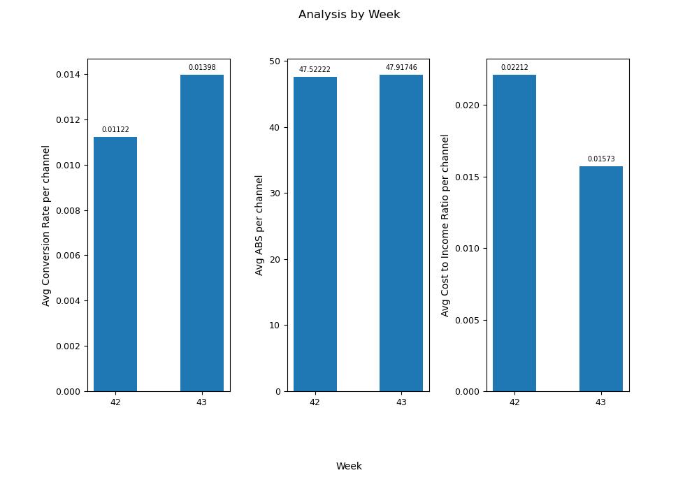
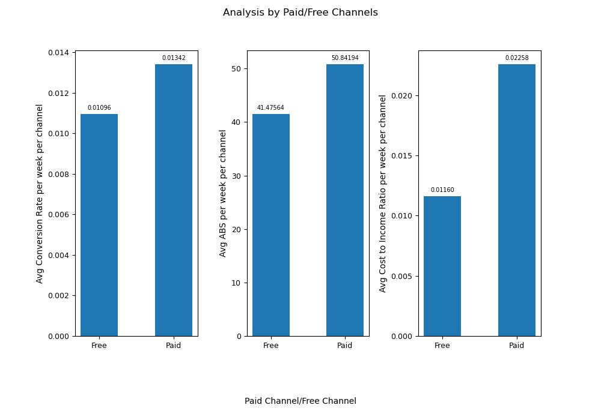
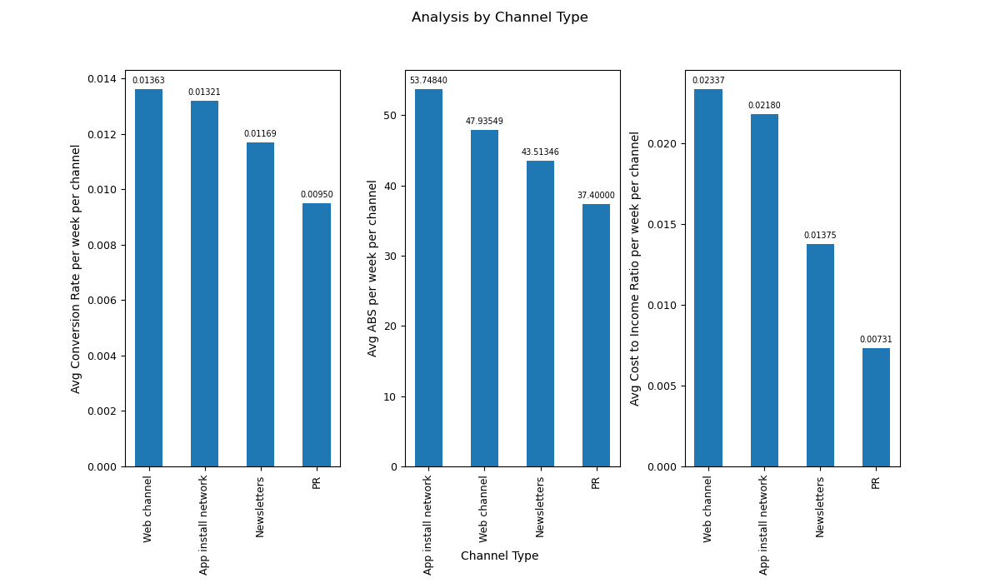
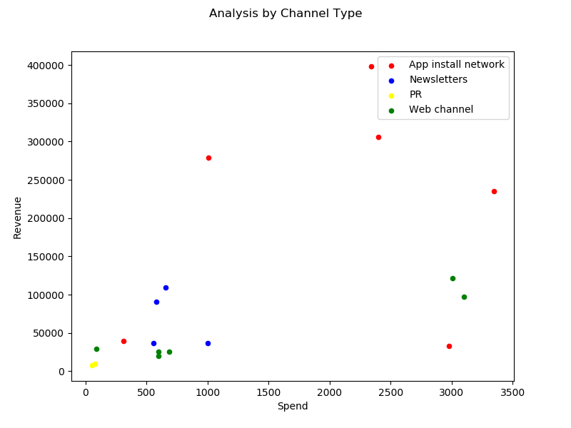

# GFG Interview Question

## Instruction to run the code

The python script *GFG_analysis.py* will product plots needed
for the interview analysis.

To create the virtual environment for this project, 
go the project folder and run the command below
```
$ conda env create -f environment.yml
```

To run the script, go the project folder and run script as bellow
```ssh
$ python GFG_analysis.py
``` 

The plots will be shown in the folder *plots/*.
The hypothesis testing results will be in the folder *output/*

## Analysis

### Analysis By Week

As shown in graph below, average CR per channel and 
average ABS per channel have both increased from week 42 to week 43. 
Average CIR per channel has dropped from week 42 to week 43.



### Analysis By Paid/Free Channels

As shown in graph below, on average, paid channels have higher CR, higher ABS and higher CIR compared to Free channels.



### Analysis By Channel Type

As shown in graph below, on average, Web channels have the highest CR, and PR has the lowest CR.
App install network has highest average ABS, PR has the lowest average ABS.
Web channel has highest average CIR, PR has lowest average CIR.



### Correlation Between Spend and Revenue

Below graph shows relation between Spend and Revenue in the sample.
Generally, Revenue increases with increase in Spend.



We split the dataset by sales channel (App install network,Web channel,Newsletters, PR) and by Paid/Free.
We calculate Pearson's correlation coefficient and p-value in each sub-dataset.

| type                | Correlation_Coefficient | p_value             | 
|---------------------|-------------------------|---------------------| 
| app_install_network | 0.20858175069881058     | 0.6916646889349454  | 
| web_channel         | 0.9597260674306585      | 0.00240032251611241 | 
| newsletters         | -0.410710106323134      | 0.589289893676866   | 
| PR                  | 1.0                     | 1.0                 | 
| paid                | 0.4385121565195754      | 0.15386985149294757 | 
| free                | 0.5277636853104707      | 0.28185467112503587 | 

At 5% significance level, we reject the null hypothesis that Spend is 
uncorrelated to Revenue in web sales channels.
